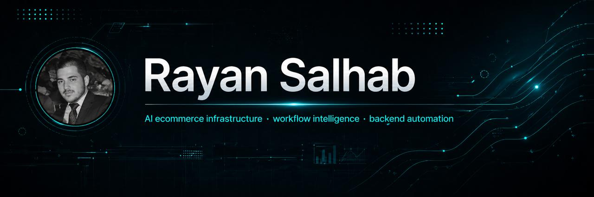

  

# Rayan Salhab

I build businesses, systems, and teams around technology.

Founder/CTO working at the intersection of AI, ecommerce infrastructure, automation, and backend systems.

I focus on turning ambitious ideas into practical systems that are fast, scalable, and useful in the real world.

## Focus

- AI-powered ecommerce infrastructure
- Catalog intelligence and data enrichment
- Marketplace and Shopify tooling
- Workflow automation systems
- Backend APIs, queues, and integrations
- Developer and internal productivity tools

## Selected work

- Bay3.ai: AI-powered ecommerce tooling for product discovery, enrichment, and listing workflows
- AIY Expert Solutions: software, automation, AI systems, and technology execution

## Tech

TypeScript · Node.js · React · Next.js · Python · PostgreSQL · Redis · Docker · Shopify · Cloudflare · AI APIs

LinkedIn: https://linkedin.com/in/rayan-salhab/
